# Image Classification using AWS SageMaker

Use AWS Sagemaker to train a pretrained model that can perform image classification by using the Sagemaker profiling, debugger, hyperparameter tuning and other good ML engineering practices. This can be done on either the provided dog breed classication data set or one of your choice.

## Project Set Up and Installation
Enter AWS through the gateway in the course and open SageMaker Studio. 
Download the starter files.
Download/Make the dataset available. 

## Dataset
The provided dataset is the dogbreed classification dataset.


### Access
Upload the data to an S3 bucket through the AWS Gateway so that SageMaker has access to the data. 

## Hyperparameter Tuning
In this experiment, I chose the ResNet18 model for image classification. ResNet, or Residual Networks, is a classic neural network used as a backbone for many computer vision tasks. ResNet18 is a variant that is 18 layers deep and offers a good balance between computational efficiency and model performance.

I used a pre-trained version of this model on ImageNet, a large dataset of 1.2 million images across 1000 categories. By doing this, I can leverage the patterns learned from a broader dataset, which can boost the performance of the model when my own dataset might not be very large or diverse.

In this script, I tuned the following hyperparameters:

Learning Rate (lr): This hyperparameter is crucial in the optimization process. The learning rate determines how quickly or slowly we move towards optimal weights. If it's too large, the optimal solution can be overshot, and if it's too small, too many iterations would be required to converge to the best values. Therefore, choosing an appropriate learning rate is essential. In this script, it's set to default at 0.001.

Batch Size (batch_size): This hyperparameter is the number of training examples used in one iteration. The batch size can significantly impact the training of the model. If it's too small, training can be slow and may not converge, while if it's too large, it might result in poorer generalization performance. The default batch size in this script is 64.

Number of Epochs (epochs): This hyperparameter refers to the number of times the learning algorithm will work through the entire training dataset. The appropriate number of epochs typically depends on how quickly your model can learn and the complexity of your task. In this script, the default number of epochs is set to 5.

All these parameters can be modified when running the script to find the most optimal configuration for the specific task at hand.

HPO Tuning Job
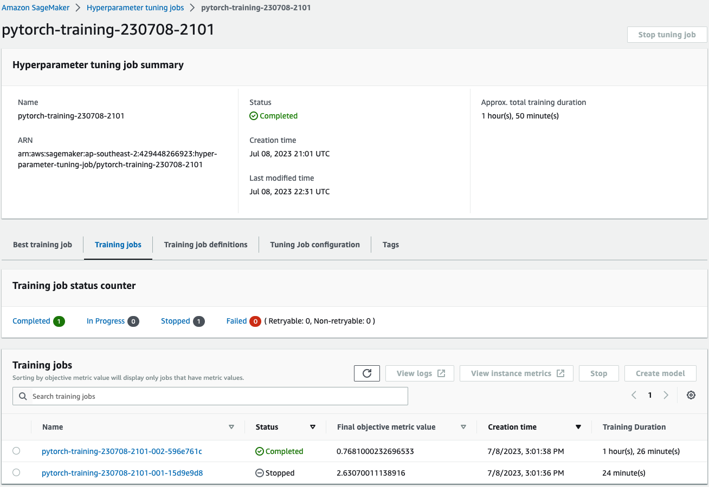

Training Job 
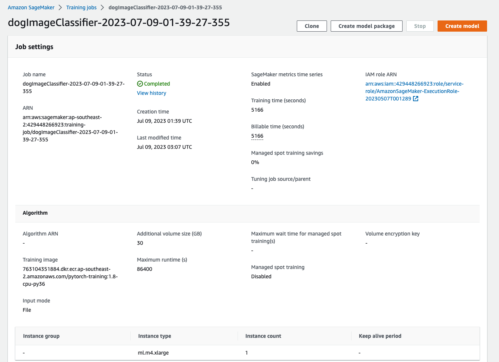

Best Parameters
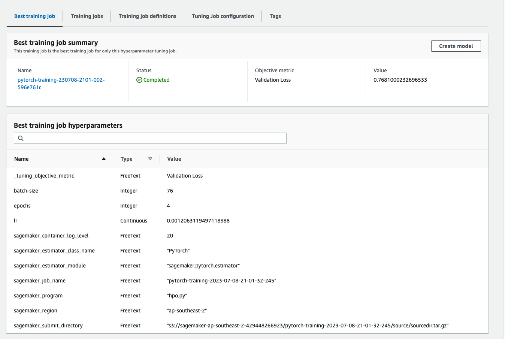

## Debugging and Profiling
1. Debugging with SageMaker Debugger:

First, I incorporated SageMaker Debugger into my PyTorch training script. This involved defining a DebugHookConfig and DebugRuleConfigurations when setting up my training job. The DebugHookConfig outlined where to store the output tensors, and DebugRuleConfigurations specified the rules to monitor the training.

During the training, Debugger saved tensors at specified intervals, providing insights into the training process in real-time. When Debugger rules detected issues such as vanishing gradients or weight updates not occurring, I received an alert. Using the analysis tools of Debugger, I analyzed the tensors to understand the issue and made necessary adjustments to the model or training parameters.

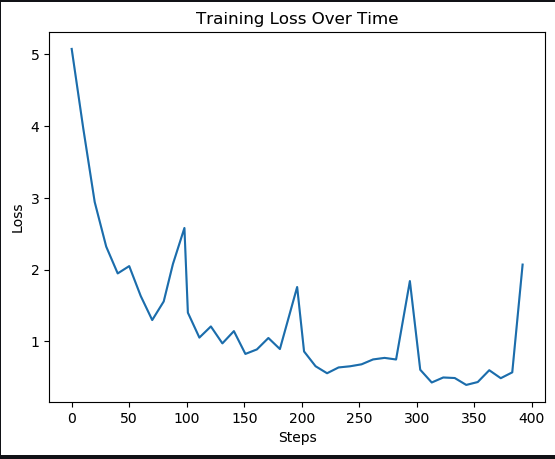

2. Profiling with SageMaker Debugger:

For profiling, I utilized Debugger's profiling features to understand how the training job used the hardware resources.

I enabled system and framework profiling when configuring the training job and specified the start time and frequency of profiling. During the training, Debugger captured system metrics like CPU and GPU utilization, and memory usage, as well as PyTorch-specific framework metrics such as operation-level timelines.

Using Debugger's profiling rules, I identified resource bottlenecks and other performance issues. If I found issues like high resource utilization, I optimized my model and training code to use resources more efficiently.


3. Using SageMaker Studio:

Lastly, I used SageMaker Studio to visually analyze and debug the training process. The SageMaker Studio Debugger Insights feature provided visualizations of the tensors and system metrics, which helped me to quickly identify issues and bottlenecks.

### Results
Here are the insights I gained from profiling and debugging the PyTorch model using AWS SageMaker:


**1. LowGPUUtilization**: I found that my model was effectively utilizing the available GPU resources. This is indicated by a LowGPUUtilization score of 0, suggesting no significant underutilization or fluctuation in GPU use.

**2. LoadBalancing**: The LoadBalancing score was 0, indicating no significant workload imbalances across the GPUs during my training job. This suggests that my distributed training strategy is effective.

**3. MaxInitializationTime**: The MaxInitializationTime rule returned a score of 427, exceeding my threshold of 20. This suggests that the initialization time of my model was too long and needs to be optimized.

**4. IOBottleneck**: The IOBottleneck rule returned a score of 5116, vastly exceeding my set threshold of 50. This indicates a potential I/O bottleneck where the GPU was often waiting for data from storage. This suggests a need to pre-fetch data or use a more efficient file format.

**5. Dataloader**: The Dataloader rule returned 53, indicating that an appropriate number of data loaders were running in parallel. This shows that my data loading process is well-optimized.

**6. StepOutlier**: The StepOutlier rule returned 427, indicating the presence of outliers in step duration. This suggests potential system bottlenecks that I need to investigate.

**7. BatchSize**: The BatchSize rule returned a score of 5099, indicating that the GPUs might be underutilized due to a small batch size. This suggests that I should consider increasing the batch size or using a smaller instance type.

**8. GPUMemoryIncrease**: The GPUMemoryIncrease score of 0 indicates that my GPU memory footprint remained stable during training.

**9. CPUBottleneck**: The CPUBottleneck rule returned a score of 5116, significantly over my threshold of 50. This suggests a CPU bottleneck where my GPU is waiting for data from the CPU. To mitigate this, I'll need to consider increasing the number of data loaders or implementing data pre-fetching.

In conclusion, the insights from debugging and profiling indicated potential bottlenecks in initialization, I/O, step durations, batch size, and CPU utilization. My next steps will be to optimize these areas to improve the efficiency of my model's training process.

Profiling

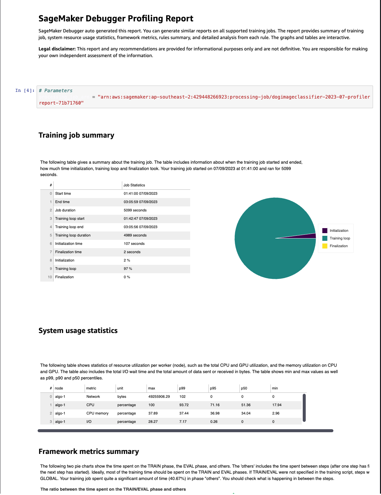
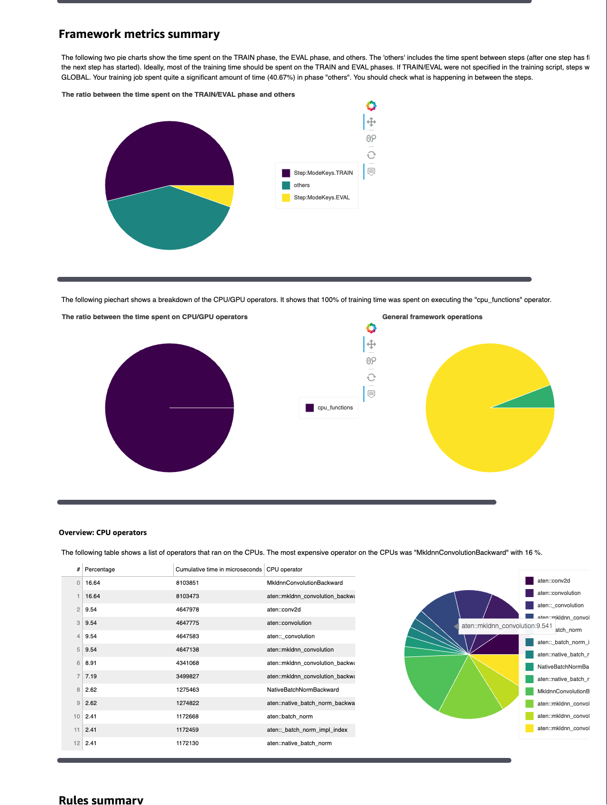
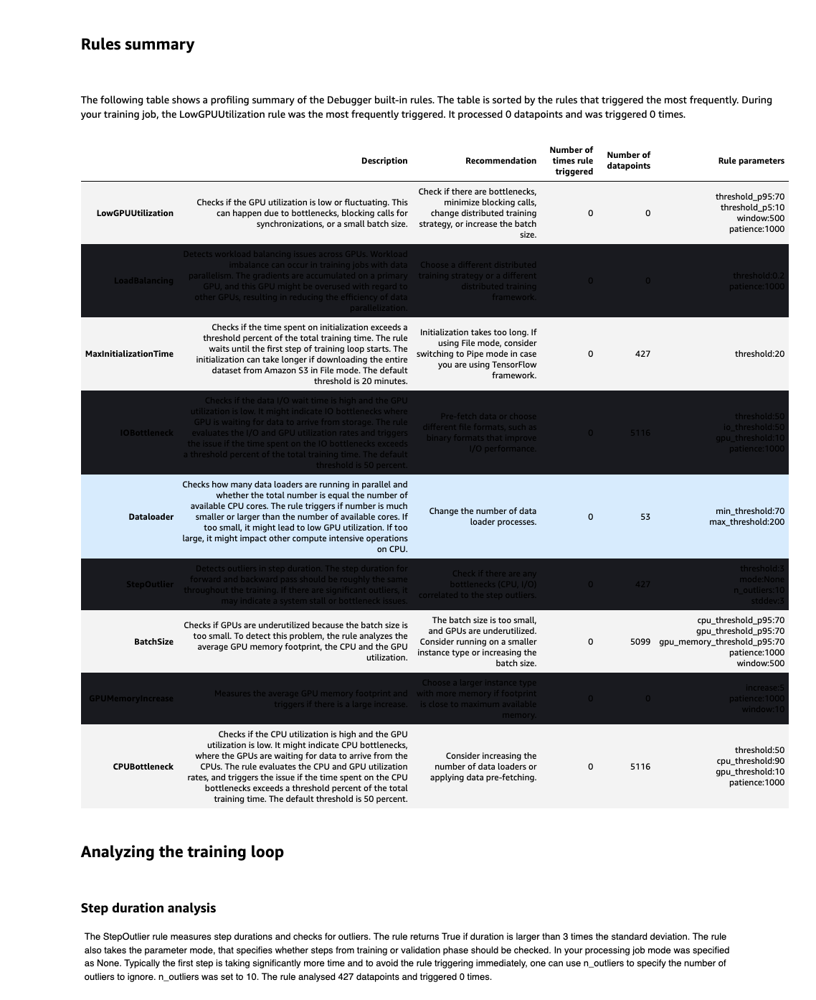
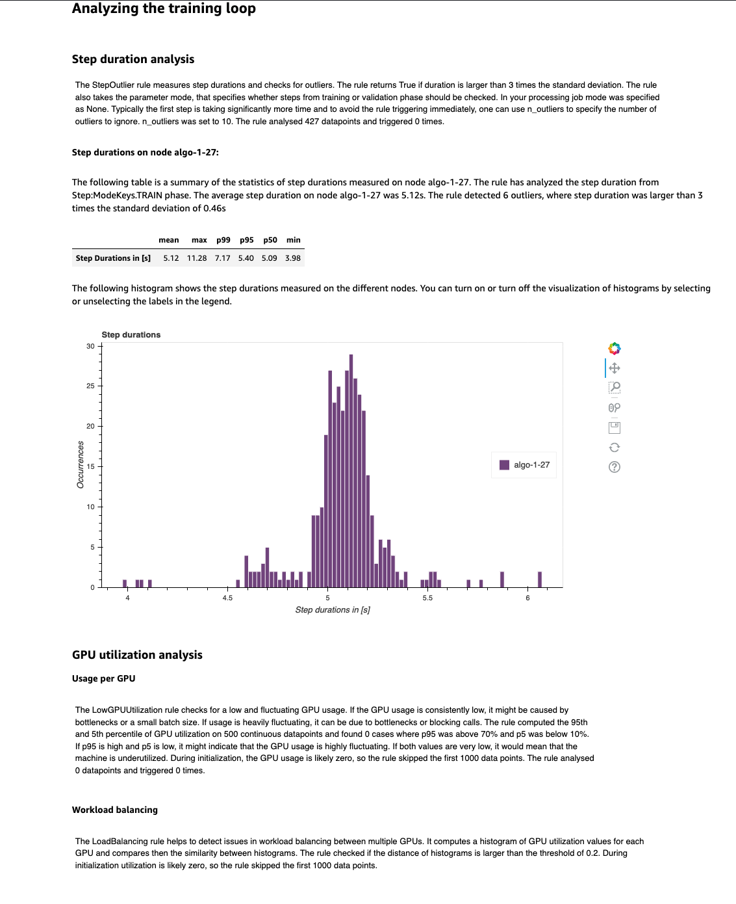
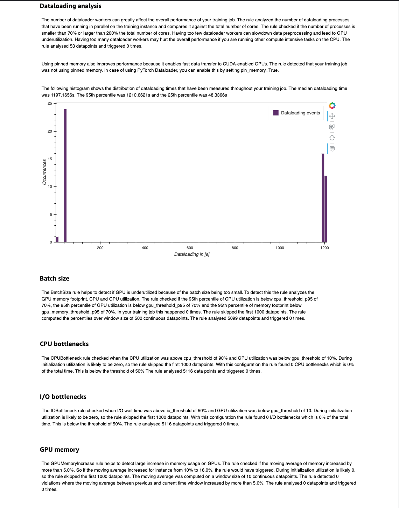

## Model Deployment
The PyTorch model I've deployed is designed to predict dog breeds. I've engineered a custom image predictor class, `ImagePredictor`, to facilitate predictions on image data.

To initialize this predictor, I provide it with the endpoint name and the current SageMaker session. In addition to this, the class uses a JPEG serializer and a JSON deserializer for input and output data processing respectively.

I create an instance of our PyTorch model using the `PyTorchModel` class and specify its model data location, the role, the entry point ('predict.py'), the Python version('py36'), and the framework version('1.8'). I also specify that I'm using our custom `ImagePredictor` class. 

After setting up the model, I deploy it with one instance of type "ml.g4dn.xlarge". 

To make predictions, I use the `pred_dog_breed_index` function. This function accepts an image, opens it, and stores it in a bytes buffer in JPEG format. The buffered image is passed to the predictor which returns the predicted dog breed.

Here is an example of how to use the function:

```python
def pred_dog_breed_index(img):    
    buf = io.BytesIO()
    Image.open(img).save(buf, format="JPEG")
    response = predictor.predict(buf.getvalue(), initial_args={"ContentType": "image/jpeg"})
    
    return response
```
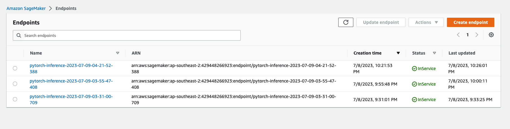
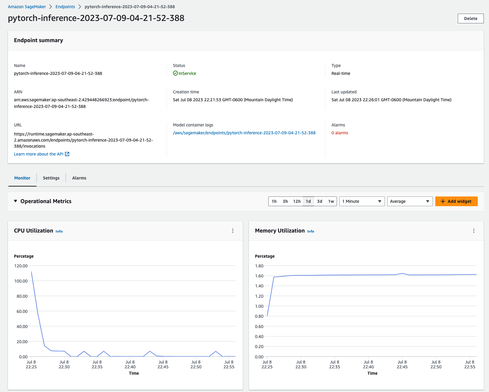
